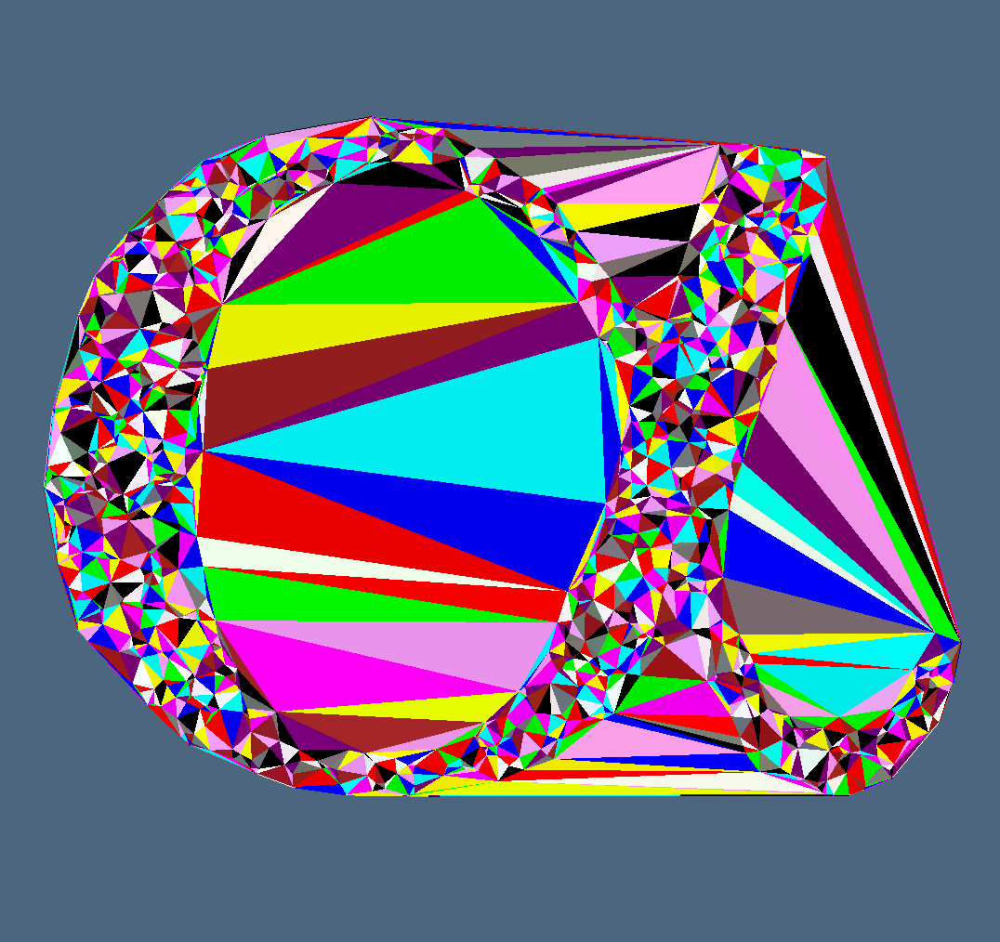
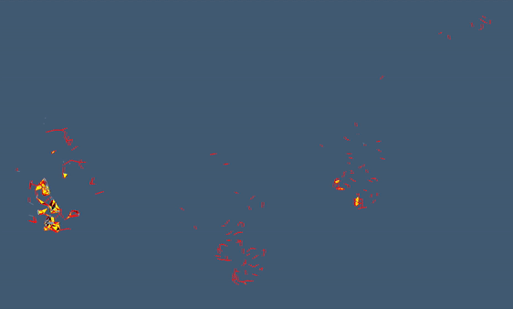

# 3.3 - Introduction to ``\alpha``-Structures



Let as usual ``S`` a set of ``n`` sites in ``\mathbb R^D`` (finite).
Since we are interested in real situation we will restrict to the case ``D \in \{2, 3\}``; however the following description could be simply enlarged for a general ``D`` value.

Suppose we want to build is something like "the shape formed by these points".
Of course it could be done in many ways: ``\alpha``-shapes are one of them.

Suppose than that we want to take this ``\alpha``-shape and we want to build its complete structure: in other words we want to evaluate each and every ``d``-simplex (with ``d \in [0, D]``) it could be made of; something like "the bricks this shape is made of".
This problem also could be solved in many ways: ``\alpha``-complexes are one of them.

As Edelbrunner and Mücke said in their paper [EM92] ``\alpha``-shapes could be thinked as the following.
Imagine a huge mass of ice-cream making up the space ``\mathbb R^d`` and containing the points ``S`` as "hard" chocolate pieces. Using one of these sphere-formed ice-cream spoons we carve out all parts of the ice-cream block we can reach without bumping into chocolate pieces, thereby even carving out holes in the inside (*eg.* parts not reachable by simply moving the spoon from the outside). We will eventually end up with a (not necessarily convex) object bounded by caps, arcs and points; we will call this object ``\alpha``-hull of ``S``. If we now straighten all "round" faces to triangles and line segments, we have an intuitive description of what is called the ``\alpha``-shape of ``S``, denoted by ``\mathcal T``.

But what is ``\alpha`` after all? In the ice-cream analogy above, ``\alpha`` is the squared radius of the carving spoon. A very small value will allow us to eat up all of the ice-cream except the chocolate points themselves. Thus for ``\alpha \to 0`` the ``\alpha`` shape degenerates to the sites set ``S``. On the other hand, a huge value of ``\alpha`` will prevent us even from moving the spoon between two points since it is too large and we will never spoon up the ice-cream lying in the inside of the convex hull of ``S``. Hence, the ``\alpha``-shape becomes the convex hull of ``S`` as ``\alpha \to \infty``.


## Geometrical Concept

We will shortly discuss all the geometrical concepts that are needed to understand what an ``\alpha``-structure is.


### ``\alpha``-hulls and ``\alpha``-diagrams

First of all we need to identify what the spoon of the introduction is.

!!! definition
    For each ``0 < \alpha < \infty`` let an ``\alpha``-ball be an open ball with radius ``\alpha``.
    We will identify with ``B_x(\alpha)`` the ``\alpha``-ball centered in ``x``.
    For completenes we could therefore impose that ``B_x(0)`` represents the point ``x``.
    Now, a certain ``\alpha``-ball ``B`` (at a given location) is called empty if ``B \cap S = \emptyset``.

We can then define what an ``\alpha``-hull is, using the previous definition.

!!! definition
    For each ``0 < \alpha < \infty`` we define the ``\alpha``-hull ``\mathcal H_\alpha`` of ``S`` as the complement of the union of all empty ``\alpha``-balls:
    ```math
        \mathcal H_\alpha := \overline{ \bigcup_{x \in \mathbb R^d} \{D_\alpha(x) \mid D_\alpha(x) \cap S = \emptyset \} }
    ```


It follows from the previous definition the following three facts:
 - if ``\alpha_1 \leq \alpha_2`` then ``\mathcal H_{\alpha_1} \subseteq \mathcal H_{\alpha_2}``;
 - for ``\alpha\to\infty`` we obtain that ``\mathcal H_\alpha`` corresponds to the convex hull of ``S``;
 - ``\mathcal H_0 = S`` since only the sites are considered.

One more usefull concept related to what we are introducing is the ``\alpha``-diagramm defined as follows

!!! definition
    For each ``0 < \alpha < \infty`` we define the ``\alpha``-diagram ``\mathcal U_\alpha`` of ``S`` as the the union of all the ``\alpha``-balls centered in the sites of ``S``:
    ```math
        \mathcal U_\alpha :=  \bigcup_{s \in S} D_\alpha(s)
    ```

It is pretty clear that there is a strict relation between ``\mathcal H_\alpha`` and ``\mathcal U_\alpha``. In fact a point ``x`` belongs to ``\mathcal U_\alpha`` if and only if ``B_x(\alpha) \cap \mathcal H_\alpha \ne \emptyset``. Therefore we obtain the following relations
```math
	\begin{split}
		x \in \mathcal U_\alpha \iff B_x(\alpha) \cap \mathcal H_\alpha \ne \emptyset\\
		x \in \mathcal H_\alpha \iff B_x(\alpha) \subseteq \mathcal U_\alpha
	\end{split}
```

### ``\alpha``-Shapes and ``\alpha``-Complexes

We have so far talked about sets. What we are interested in are however complex of simplices. We therefore drop the curved edges of ``\alpha``-hulls in favor of straight lines.

What we have described take the name of ``\alpha``-shape of ``S``: we will denote it ``\Sigma_\alpha(S)`` or, shortly, ``\Sigma``. In fact it gives us a boundary of what is internal to the point cloud made of the Sites ``S`` and what is and outsider. It is trivial to understand that ``\Sigma`` is mainly made of ``D-1``-simplices and it could not have ``D``-simplices at all.

However ``\Sigma`` comes with a notion of Delaunay Triangulation and, since the general position condition is satisfied by hypotesis, it follows that the polytope decomposition of the ``\alpha``-hull is unique. We define:

!!! definition
    The Delaunay Triangulation of ``\Sigma_\alpha(S)`` takes the name of ``\alpha``-complex of ``S``: we will denote it ``\mathcal A_\alpha(S)`` or, shortly, ``\mathcal A``.

It then follows from the way we have defined it that if a ``d``-polytope (``d``-cell) is in ``\mathcal A`` then every cell it is made of is also inside ``\mathcal A``.

### ``\alpha``-Filtration



We now introduce the case of study of what happends if we vary the ``\alpha`` value. In general this topic is strictly related to Persistent Homology (we will see in the next section).

The first observation we could make is that the bigger is the value ``\alpha`` the more simplices get into the complex ``\mathcal A``.

It is although pretty clear that if a simplex is in ``\mathcal A`` for a certain ``\alpha`` than it will be in ``\mathcal A`` for every ``\alpha' \geq \alpha``. It then makes sense to search for the first value ``\alpha`` such that each single simplex ``\sigma`` gets inside ``\mathcal A``. We will define it as:

!!! definition
    Let ``\mathcal A_\infty(S) \equiv \mathcal D(S)`` the Delaunay complex of ``S``. For each simplex ``\sigma \in \mathcal D(S)`` we define the _characteristical ``\alpha`` of ``\sigma``_ like the infimum ``\alpha`` such that ``\sigma \in \mathcal A_\alpha(S)``:
    ```math
        \alpha_\sigma = \inf_{\alpha \geq 0}\{\sigma \in \mathcal A_\alpha(S)\}
    ```

This last definition gives us a better way to build up the ``\alpha``-Complex:
```math
    \mathcal A_\alpha = \{\sigma \in \mathcal D(S) \mid \alpha_\sigma \leq \alpha\}
```

It is of particular interest note that the characteristical `\alpha` of each simplex is bigger or equal than those of the simplices (of lower degree) it is made of:
```math
    \alpha_\sigma \geq \alpha_{\sigma'} \quad \forall \sigma' \subseteq \sigma
```

With this knowledge it is pretty clear that we can sort the simplices via their characteristical ``\alpha`` like the comes in the ``\alpha``-complex. We therefore could define what we call _``\alpha``-Filtration_:

!!! definition
    Let ``\mathcal D`` the Delaunay triangulation of a set of Sites ``S``.
    We define an ``\alpha``-Filtration of ``S`` like the sequence of Complexes that grows accordingly to the ``\alpha`` value, namely:
    ```math
        \emptyset \ =\ K_0 \subseteq K_{\alpha_1} \subseteq K_{\alpha_2} \subseteq \dots \subseteq K_{\alpha_k} \ =\ \mathcal D
    ```

In particular this will be the key we use in our algorithm to evaluate the ``\alpha``-structures.
We will describe more precisely how to evaluate the characteristical ``\alpha`` in the _"Alpha Structures Implementation"_ [section 4.2](https://eonofri04.github.io/AlphaStructures.jl/alpha-structures-impl/).

## Other ``\alpha``-structures

Since we have defined ``\alpha``-complexes via Delaunay Triangulation it makes sense think that we could also define them via Regular Triangulation.

We can therefore divide ``\alpha``-shapes into two families:
 - **Basic ``\alpha``-shapes** are based on the Delaunay triangulation.
 - **Weighted ``\alpha``-shapes** are based on the Regular Triangulation, a Delunay generalization where the euclidean distance is replaced by the power to weighted points.
