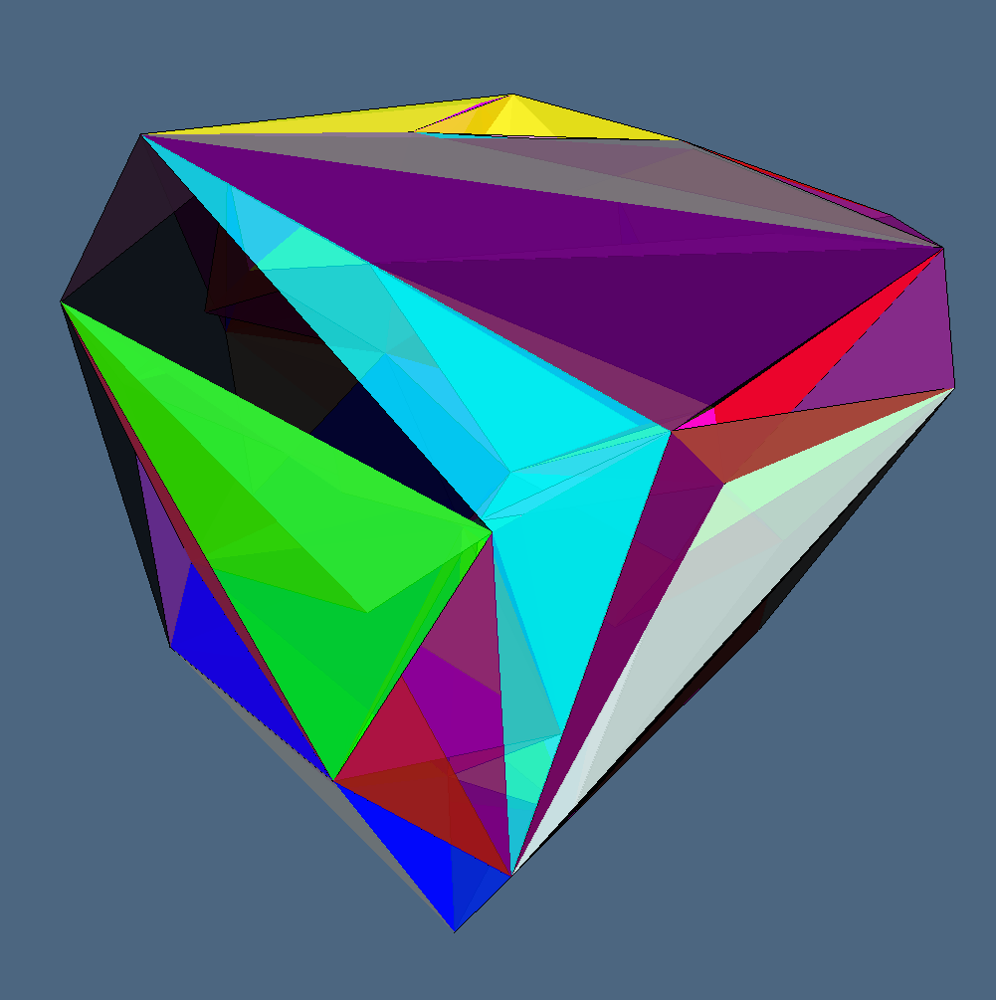
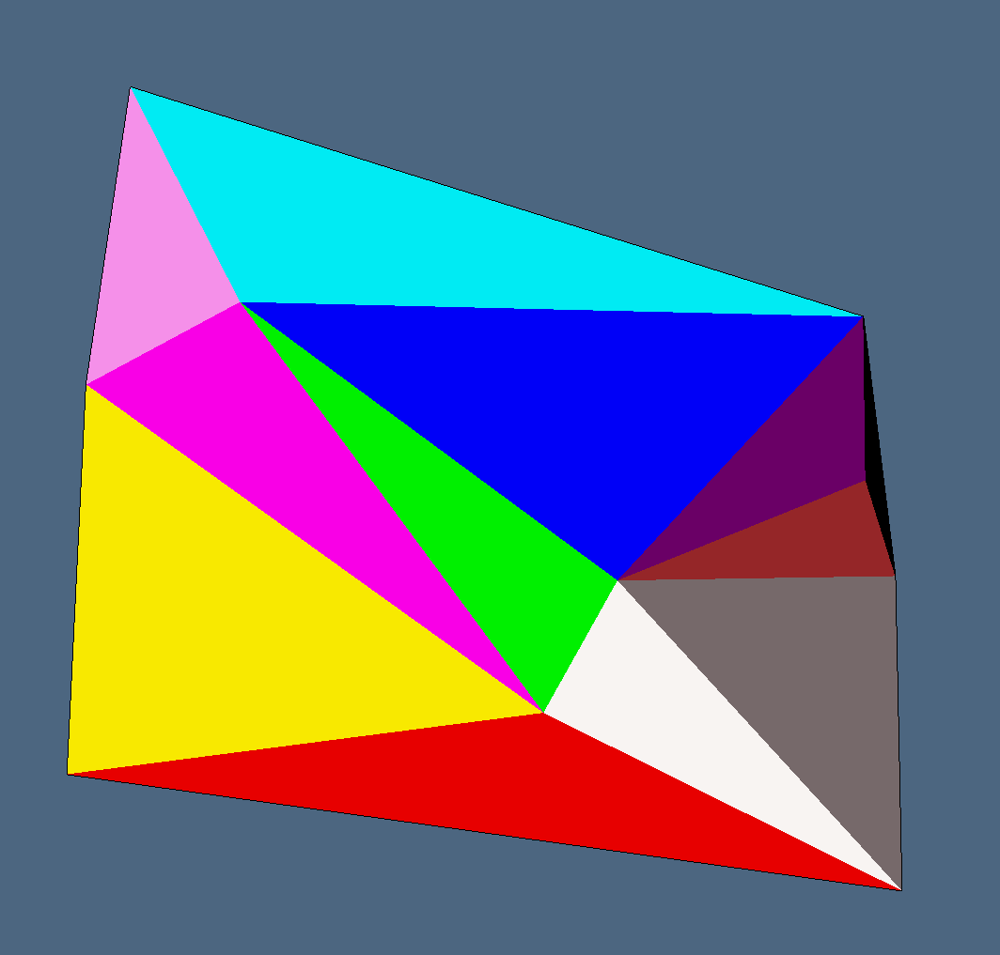

# 4.1 - Delaunay Wall Triangulation Algorithm

We approached the problem as described in [CMS97] and [CMS98].



## Advantage

The duality between Delaunay Triangulations and Voronoi diagrams has been discussed in [section 3.1](https://eonofri04.github.io/AlphaStructures.jl/delaunay/) and [section 3.2](https://eonofri04.github.io/AlphaStructures.jl/voronoy/).
However, direct construction methods are generally more efficient because the Voronoi diagram does not need to be computed and stored. Various approaches have been historically used:
  - Local improvement: starting with an arbitrary triangulation these algorithms locally modify the faces of pairs of adjacent simplices according to the circumsphere criterion.
  - On line (or incremental insertion): starting with a simplex which contains the convex hull of the point set these algorithms insert the points in `P` one at a time. The simplex containing the currently added point is partitioned by inserting it as a new vertex. The circumsphere criterion is tested on all the simplices adjacent to the new ones recursively and, if necessary, their faces are flipped.
  - Incremental construction: the DT is constructed by successively building simplices whose circumhyperspheres contain no points in `P`.
  - Higher dimensional embedding: these algorithms transform the points into the ``E^{d+1}`` space and then compute the convex hull of the transformed points the DT is obtained by simply projecting the convex hull into ``E^{d}``.
  - Classic D&C algorithms: this is based on the recursive partition and local triangulation of the point set and then on a merging phase where the resulting triangulations are joined.

The algorithm we have choosen to encode is one of the latter class. Its peculiarity is that the computational phase is located in the Divide Step (instead of the merge step).
Delaunay Wall algorithm first subdivides the input dataset, then builds that part of the DT that should be built in the merge phase of a classic D&C algorithm and then recursively triangulates the two half–spaces, taking into account the border of the previously computed merge triangulation.

## Delauany Wall Pipeline

The DeWall (Delaunay Wall) algorithm could be summed up by following pipeline:
  1. select a hyperspace ``\alpha`` that divides the space into two halfspaces
  1. split the sites ``S`` into two subset: ``S^-`` and ``S^+`` (the points in the negative and positive halfspace)
  1. construct the *Wall* (``\Sigma^\alpha``) of the Delaunay simplices over that intersect the plane ``\alpha``
  1. recursively apply DeWall on ``S^-`` to obtain ``\Sigma^-``
  1. recursively apply DeWall on ``S^+`` ro obtain ``\Sigma^+``
  1. merge ``\Sigma^\alpha``, ``\Sigma^-`` and ``\Sigma^+``.

In particular we have that:
```math
	\begin{split}
		\Sigma^\alpha =& \{\sigma \in \mathcal D_S \mid \sigma \cap \alpha \ne \emptyset }\\
		\Sigma^- =& \{\sigma \in \mathcal D_S \mid \sigma \in \mbox{NegHalfspace}(\alpha)}\\
		\Sigma^- =& \{\sigma \in \mathcal D_S \mid \sigma \in \mbox{PosHalfspace}(\alpha)}
	\end{split}
```

and therefore by construction we have that ``\Sigma^\alpha``, ``\Sigma^-`` and ``\Sigma^+`` are disjoint and

```math
	\Sigma^\alpha \cup \Sigma^- \cup \Sigma^+ = \mathcal D_S
```

### Construct simplex wall ``S^\alpha``

The simplex wall ``\Sigma^\alpha`` can be simply computed by using an incremental construction approach.

First of all we define three **active face lists**:
  - ``AFL^\alpha``: the ``(d - 1)``-simplices intersecting ``\alpha``
  - ``AFL^+``: the ``(d - 1)``-simplices totally located in the negative halfspace defined by ``\alpha``
  - ``AFL^-``: the ``(d - 1)``-simplices totally located in the positive halfspace defined by ``\alpha``

The algorithm starts by constructing an initial ``d``-simplex ``\sigma_0`` that intersect the hyperplane (if no active faces are provided). Then, it processes all of the ``(d - 1)``-simplices of ``σ_0`` by splitting them into the Active Face Lists.
From now on the ``AFL^\alpha`` is progressively emptied (and filled) by taking one at time the simplices in it.

For each ``d-1``-simplex ``\eta`` (wich will belongs to a ``d``-simplex ``\sigma^1 \in \mathcal D_S``) the algorithm finds out the only other ``d``-simplex ``\sigma^2`` (if it exists) incident on ``\eta``: to do so the algorithm looks for the closest point (according to circumradius distance) to the face that do not belongs to the halfspace where the simplex ``\sigma^1`` is. Lastly all of the new ``(d - 1)``-simplex of ``\sigma^2`` are splitted between the Active Face Lists (do not that in this procedure, if a face is already present in the AFL than it is simply removed since the two simplices incident over it have been found).
!!! fact
    For each ``(d - 1)``-simplex ``\eta``, which does not lie on the convex hull of ``S``, there are exactly two simplices ``\sigma^1`` and ``\sigma^2`` in ``\mathcal D_S``, such that ``\sigma^1 \cap \sigma^2 = f``.
    If the algorithm is not able to find out a second simplex incident on ``\eta`` we can therefore claim that that simplex belongs to the convex hull of ``S``.

When the process is over, the wall has been built.
It remains to use the Active Face Lists of the positive and negative halfspaces.

### Recursively call DeWall

The wall building process is then applied again to the two halfspaces defined by ``\alpha`` by choosing another ``\alpha``-hyperplane.
However if only the points in the halfspace are given to the new call of the function, a careful look must be given to the new simplex evaluated.
In fact it could happen that point that earlier where closer to points in the other halfspace, now are closer to other points in the same halfspace.
To avoid this annoying situation (solvable in the merge phase checking if any simplex is intersecting any other) a faster solution is to bring into the recursive step also the points that forms the previous walls and discard the simplices that will be formed with that points (in our code, the `blacklist`).

### Merging the Delaunay Triangulations

If the trick described in the last paragraph have been applied than no particular operations but the merging must be made at this point. In fact the triangulations will be completely disjoint and their intersection will give us back only ``AFL^-`` and ``AFL^+``.

## Examples

The input is a set of points in ``\mathcal R^d``, of type `Lar.Points`, the output is a set of ``d``-simplices, of type `Lar.Cells`.
So we can create a LAR model to view.

### 3D Delaunay triangulation

```julia
julia> using AlphaStructures, ViewerGL;

julia> GL = ViewerGL;

julia> V = [
 0.0 1.0 0.0 1.0 0.0 1.0 0.0 1.0
 0.0 0.0 1.0 1.0 0.0 0.0 1.0 1.0
 0.0 0.0 0.0 0.0 1.0 1.0 1.0 1.0
];

julia> DT = AlphaStructures.delaunayWall(V)
6-element Array{Array{Int64,1},1}:
 [1, 2, 4, 5]
 [1, 3, 4, 5]
 [2, 4, 5, 6]
 [3, 4, 5, 7]
 [4, 5, 6, 7]
 [4, 6, 7, 8]

julia> GL.VIEW([
	GL.GLExplode(
		VS,
		[[σ] for σ in DT],
		1.5, 1.5, 1.5,	# Explode Ratio
		99, 1			# Colors
	)
]);

```

### 2D Delaunay triangulation
```julia

julia> using AlphaStructures, ViewerGL;

julia> GL = ViewerGL;

julia> V = [
 0.0 2.0 0.0 4.0 5.0
 0.0 0.0 3.0 1.0 5.0
];

julia> DT = AlphaStructures.delaunayWall(V)
3-element Array{Array{Int64,1},1}:
 [2, 3, 4]
 [3, 4, 5]
 [1, 2, 3]

julia> GL.VIEW([
	GL.GLExplode(
		VS,
		[[σ] for σ in DT],
		1., 1.,	1.	# Explode Ratio
		99, 1		# Colors
	)
]);

```

## Main Interface

The solution we have proposed is located in the `alphaFilter` function (in [this](https://github.com/eOnofri04/AlphaStructures.jl/blob/master/src/deWall.jl) file):

```@docs
	AlphaStructures.delaunayWall
```

```@docs
	AlphaStructures.findWallSimplex
```

```@docs
	AlphaStructures.firstDeWallSimplex
```


```@docs
    AlphaStructures.recursiveDelaunayWall
```
